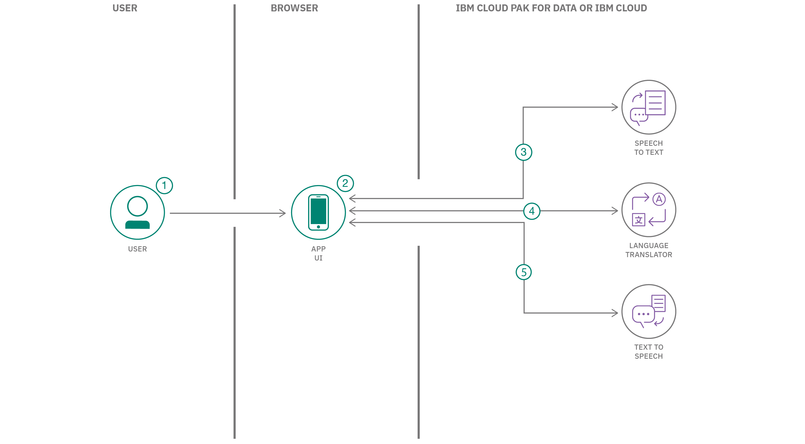
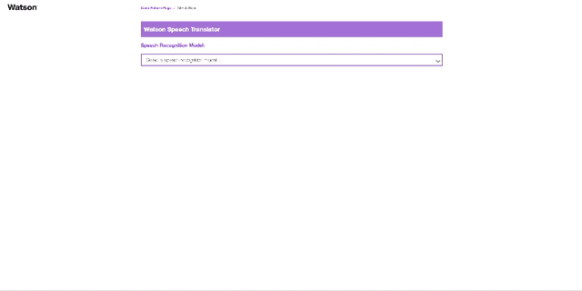

# Create a language translator app with voice input and output

In this code pattern, we will create a language translator web app. Built with React components
and a Node.js server, the app will capture audio input and stream it to a
Watson Speech to Text service. As the input speech is transcribed, it will also be sent to a
Watson Language Translator service to be translated into the language you select. Both the transcribed and translated
text will be displayed by the app in real time. Each completed phrase will be sent to Watson Text to Speech to be spoken
in your choice of locale-specific voices.

The best way to understand what is real-time transcription/translation vs. "completed phrase" vocalization is
to try it out. You'll notice that the text is updated as words and phrases are completed and become better understood in
context. To avoid backtracking or overlapping audio, only completed phrases are vocalized. These are typically
short sentences or utterances where a pause indicates a break.

For the best live experience, wear headphones to listen to the translated version of what your microphone is listening to.
Alternatively, you can use the toggle buttons to record and transcribe first without translating. When ready, select
a language and voice and then enable translation (and speech).

When you have completed this code pattern, you will understand how to:

* Stream audio to Speech to Text using a WebSocket
* Use Language Translator with a REST API
* Retrieve and play audio from Speech to Text using a REST API
* Integrate Speech to Text, Language Translator, and Text to Speech in a web app
* Use React components and a Node.js server

> **NOTE**: This code pattern includes instructions for running Watson services on IBM Cloud or with the Watson API Kit on IBM Cloud Pak for Data.
> Click [here](https://www.ibm.com/products/cloud-pak-for-data) for more information about IBM Cloud Pak for Data.

## Flow

1. User presses the microphone button and captures the input audio.
1. The audio is streamed to Speech to Text using a WebSocket.
1. The transcribed text from Speech to Text is displayed and updated.
1. The transcribed text is sent to Language Translator and the translated text is displayed and updated.
1. Completed phrases are sent to Text to Speech and the result audio is automatically played.

## Steps

1. [Create the Watson services](#create-the-watson-services)
2. [Deploy the server](#deploy-the-server)
3. [Use the web app](#use-the-web-app)

### Create the Watson services

> Note: You can skip this step if you will be using the `Deploy to Cloud Foundry on IBM Cloud` button below. That option automatically creates the services and binds them (providing their credentials) to the application.

Provision the following services:

* **Speech to Text**
* **Language Translator**
* **Text to Speech**

The instructions will depend on whether you are provisioning services using IBM Cloud Pak for Data or on IBM Cloud.

Click to expand one:

<b>IBM Cloud Pak for Data</b>

<i>Use the following instructions for each of the three services.</i>

<h5>Install and provision service instances</h5>

The services are not available by default. An administrator must install them on the IBM Cloud Pak for Data platform, and you must be given access to the service. To determine whether the service is installed, Click the <b>Services</b> icon () and check whether the service is enabled.

<h5>Gather credentials</h5>

<ol>
    <li>For production use, create a user to use for authentication. From the main navigation menu (☰), select <b>Administer > Manage users</b> and then <b>+ New user</b>.</li>
    <li>From the main navigation menu (☰), select <b>My instances</b>.</li>
    <li>On the <b>Provisioned instances</b> tab, find your service instance, and then hover over the last column to find and click the ellipses icon. Choose <b>View details</b>.</li>
    <li>Copy the <b>URL</b> to use as the <b>{SERVICE_NAME}_URL</b> when you configure credentials.</li>
    <li><i>Optionally, copy the <b>Bearer token</b> to use in development testing only. It is not recommended to use the bearer token except during testing and development because that token does not expire.</i></li>
    <li>Use the <b>Menu</b> and select <b>Users</b> and <b>+ Add user</b> to grant your user access to this service instance. This is the user name (and password) you will use when you configure credentials to allow the Node.js server to authenticate.</li>
</ol>

<b>IBM Cloud</b>

<h5>Create the service instances</h5>
  <ul>
    <li>If you do not have an IBM Cloud account, register for a free trial account <a href="https://cloud.ibm.com/registration">here</a>.</li>
    <li>Click <a href="https://cloud.ibm.com/catalog/services/speech-to-text">here</a> to create a <b>Speech to Text</b> instance.</li>
    <li>Click <a href="https://cloud.ibm.com/catalog/services/language-translator">here</a> to create a <b>Language Translator</b> instance.</li>
    <li>Click <a href="https://cloud.ibm.com/catalog/services/text-to-speech">here</a> to create a <b>Text to Speech</b> instance.</li>
  </ul>
<h5>Gather credentials</h5>
  <ol>
    <li>From the main navigation menu (☰), select <b>Resource list</b> to find your services under <b>Services</b>.</li>
    <li>Click on each service to find the <b>Manage</b> view where you can collect the <b>API Key</b> and <b>URL</b> to use for each service when you configure credentials.
  </ol>

## Deploy the server

Click on one of the options below for instructions on deploying the Node.js server.

|   |   |   |   |
| - | - | - | - |
|  |  |  |

## Use the web app

> NOTE: The app was developed using Chrome on macOS. Browser compatibility issues are still being worked out.

1. Browse to your app URL

   * Use the URL provided at the end of your selected deployment option.

1. Select a speech recognition model

   * The drop-down will be populated with models supported by your Speech to Text service.
   
1. Select an output language and voice

   * The drop-down will only include voices that are supported by your Text to Speech service.
     The list is also filtered to only show languages that can be translated from the source
     language using Language Translator.
     
1. Use the Speech to Text toggle

   * Use the `Speech to Text` button (which becomes `Stop Listening`) to begin recording audio
     and streaming it to Speech to Text. Press the button again to stop listening/streaming.
     
1. Use the Language Translation toggle

   * The `Language Translation` button (which becomes `Stop Translating`) is also a toggle.
     You can leave it enabled to translate while transcribing, or use it after you see the
     transcribed text that you'd like to translate and say.
     
1. Disable Text to Speech

   * By default, the app automatically uses Text to Speech to read the translated output.
     The checkbox allows you to disable Text to Speech.

1. Changing the language and voice

   * If you change the voice while language translation is enabled, any current transcribed
     text will be re-translated (and spoken if enabled).
     
1. Resetting the transcribed text

   * The transcribed text will be cleared when you do any of the following:
   
     * Press `Speech to Text` to restart listening
     * Refresh the page
     * Change the speech recognition model

## License

This code pattern is licensed under the Apache License, Version 2. Separate third-party code objects invoked within this code pattern are licensed by their respective providers pursuant to their own separate licenses. Contributions are subject to the [Developer Certificate of Origin, Version 1.1](https://developercertificate.org/) and the [Apache License, Version 2](https://www.apache.org/licenses/LICENSE-2.0.txt).

[Apache License FAQ](https://www.apache.org/foundation/license-faq.html#WhatDoesItMEAN)
